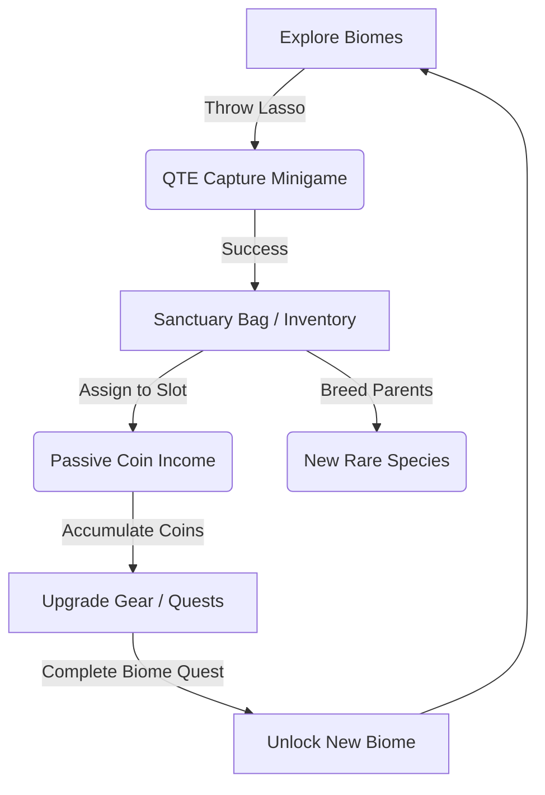

# Game Plan & Systems Documentation: Wild Haven

Wild Haven is a 2D Pixel Art Top-Down Cozy RPG and Creature Collection Simulator. Players explore rich, story-gated biomes, capture diverse creature subspecies using a lasso mini-game, manage a sanctuary enclosure to generate passive coin income, breed rare species, and follow a JRPG-style narrative questline.

---

## 1. Game Overview & Core Loop
The core loop of Wild Haven revolves around three main pillars:
1. **Explore & Capture:** Explore biomes, throw lassos, and complete a QTE tug-of-war mini-game to tame creatures.
2. **Sanctuary Management & Breeding:** Place captured pets in enclosure slots where they generate coins over time. Upgrade their levels and breed parents to unlock hybrid offspring.
3. **Narrative Progression:** Interact with NPCs (Dr. Evelyn, Elder Oak) in the starting hub, complete story quests, unlock biomes, and ascend to the legendary Sky Island to capture the Phoenix.



---

## 2. Technical Architecture & File Directory

The codebase is built on Phaser 3 and TypeScript, structured as follows:

```
src/
│
├── config/
│   └── GameConfig.ts           # Phaser engine configuration, scales, and scene registration
│
├── data/
│   ├── DataLoader.ts           # Static JSON content loader (creatures, biomes, ropes, whips)
│   └── types.ts                # TypeScript interfaces for PlayerState, Quests, and Entities
│
├── entities/
│   ├── Player.ts               # 8-way overworld controller, mounts, and animations
│   ├── WildCreature.ts         # Wild creature AI, hop behaviors, and rarity glow rings
│   └── SanctuaryCreature.ts    # Sanctuary pets producing coins and hopping near slots
│
├── scenes/
│   ├── BootScene.ts            # Phaser engine bootstrapper
│   ├── PreloadScene.ts         # Resource, sprites, and JSON configuration loader
│   ├── MainMenuScene.ts        # Title scene with drifting clouds and buttons
│   ├── ExploreScene.ts         # Biome exploration map (obstacles, weather, structures)
│   ├── SanctuaryScene.ts       # Enclosure management slots
│   └── UIScene.ts              # Parallel UI scene managing HUD, panels, and dialogues
│
├── systems/
│   ├── QuestManager.ts         # Quest state machine and LocalStorage persistence
│   ├── DialogueManager.ts      # Visual novel conversation flow and input locks
│   ├── BiomeManager.ts         # Story-gated biome travel gates
│   ├── SaveSystem.ts           # Game state serializer/autosave listener
│   ├── ProgressionSystem.ts    # Level-up calculations and biome unlock costs
│   ├── CaptureSystem.ts        # Lasso catch calculations and QTE minigames
│   ├── EconomySystem.ts        # Coin generation rates and leveling costs
│   ├── AchievementSystem.ts    # Milestones checker and login rewards
│   └── AudioManager.ts         # Synthesized procedural soundtrack/SFX mixer
│
└── ui/
    ├── HUD.ts                  # XP bar, currency tracker, and Quest tracker
    ├── DialoguePanel.ts        # Bottom-box narrative dialog overlay with typewriter effect
    ├── InventoryPanel.ts       # 4x3 grid overlay displaying captured pets
    ├── CollectionBookPanel.ts  # Biome progress scrapbook index
    ├── CreatureDetailPanel.ts  # Level-up feed panel and mounting trigger
    ├── BreedingPanel.ts        # Fusion center for combining parent pairs
    └── ShopPanel.ts            # Purchase center for lasso ropes and whips
```

---

## 3. Core Gameplay Systems

### A. Overworld Exploration & Proximity Prompts
* The overworld features a top-down orthographic camera view clamping to large coordinates (`2400x1800`).
* A player character moves in 8 directions using Keyboard keys (WASD / Arrows) or click/tap-to-move pathing.
* **Proximity Bubble Prompt:** When walking close to any interactive creature, structure, or building (under 65px), a bubble pops up over the player (e.g. `[SPACE] CATCH RABBIT` or `[SPACE] ENTER RESEARCH LAB`). Pressing Spacebar triggers interaction.

### B. QTE Capture Minigame
* Throwing a lasso at a wild creature triggers a QTE Tug-Of-War minigame.
* A tension bar appears on screen. The goal is to spam tap the screen/keys to pull the creature towards you, preventing the timer from running out or the rope from snapping.
* Whips can be bought and equipped to weaken hard-to-catch creatures before throwing the lasso.

### C. JRPG Dialogue Engine & Visual Novel Storytelling
* Interacting with the **Research Lab** or **Base HQ**, or booting the game for the first time, opens the Dialogue overlay.
* **Typing Effect:** Dialog lines render letter-by-letter (25ms intervals) with a sound tick. Pressing space or clicking skips the typing effect directly to the full sentence.
* **Procedural Portraits:** High-quality pixel art portraits are drawn on the fly via Phaser Graphics to represent characters:
  * *Dr. Evelyn:* Lavender hair, glasses, white lab coat, blue collar shirt.
  * *Keeper (Player):* Tan explorer hat with a red band and blue tunic.
  * *Elder Oak:* Old bearded mentor with a green robe and white hair.
  * *Researcher:* Shaded hood with green glowing eyes.

### D. Progressive Quest Manager & Biome Gates
* Biome progression is story-quest gated rather than purely gold-based.
* **Active Quest HUD:** A panel located below the XP bar in the top-left HUD tracks active quest objectives and updates checkbox status (e.g. `✅ Catch 3 Meadow Rabbits (3/3)`).
* Dr. Evelyn at the **Research Lab** acts as the quest hub. Turning in completed quest goals triggers dialogue cutscenes and unlocks the gate to the next biome (Whisper Forest, Crystal Mountain, Golden Dunes, Sky Island).
* Unlocking a biome pops open a cinematic fullscreen milestone window: **NEW BIOME UNLOCKED!**.

---

## 4. Biomes & Species Details

The world contains **44 distinct creatures** across **5 Biomes**. Although they map to 5 base sprite sheets (`creature_meadow` - Rabbit, `creature_forest` - Fox, `creature_mountain` - Turtle, `creature_dunes` - Golem, `creature_sky` - Phoenix), they render with unique, dynamic color tints and scale factors to represent different species.

### Biome Palette, Weather, and Key Quests:
1. **Green Meadow:** Warm grass biomes (`#8FD14F`), procedural drifting clouds, falling wind leaves. Home to Hares, Sparrows, Fawns, and Clover Stags.
   * *Main Quest:* Meadow Explorer (Catch 3 Meadow Rabbits, Accumulate 500 Coins).
2. **Whisper Forest:** Deep green shadows (`#2A5C38`), dense fog particles, falling amber leaves. Home to Squirrels, Mossy Toads, Silver Foxes, and Cerberus.
   * *Main Quest:* Forest Guardian (Catch 1 Silver Fox, Reach Keeper Level 3).
3. **Crystal Mountain:** Icy teal glow (`#E0F7F6`), falling snow particles. Home to Pebble Goats, Frost Hares, Crystal Turtles, and Aurora Wolves.
   * *Main Quest:* Mountain Climber (Catch 1 Crystal Turtle, Accumulate 2,500 Coins).
4. **Golden Dunes:** Blinding desert sand (`#F2C879`), dust storms. Home to Lizards, Falcons, Camel sages, and T-Rexes.
   * *Main Quest:* Desert Excavator (Catch 1 Dune Beetle, Reach Keeper Level 5).
5. **Sky Island:** Pastel blue clouds (`#BBF2F6`), golden sky sprites. Home to Celestial Stags, Wind Serpents, Pegasuses, and the legendary Phoenix.
   * *Main Quest:* Sky Savior (Catch 1 Phoenix, Reach Keeper Level 8).

---

## 5. Sanctuary Enclosure & Breeding Systems

The **Sanctuary Enclosure** is the player's capital engine. 

### A. Income Slots
* Placed creatures hop around their designated slots and periodically tick to produce coins (based on their base rarity rate and level multipliers).
* Upgrading a creature's level (up to 10) by feeding it coins increases its income rate.
* Levels and names show on a floating tag over their heads inside the enclosure.

### B. Breeding Mechanics
* Putting two compatible creatures inside the **Breeding Panel** fusions them to hatch a rarer egg.
* Custom recipes allow fusions: e.g. Meadow Rabbit + Frost Hare = Rare Jackalope. Breeding mythical tier species generates final hybrids.
* Breeding has a success rate percentage and coin cost.

---

## 6. Layout & Sizing Consistency Rules

To prevent overlap, distortion, or massive size glitches, the visual engine adheres to strict layout rules:

1. **Aspect Ratio Fit:** Rather than using static sizing, slots in `InventoryPanel.ts` and `CollectionBookPanel.ts` calculate the sprite aspect ratio (`w / h`) and display it scaled proportionally inside its frame box boundaries (`44x44` and `48x48`). This keeps wide, tall, and short creatures aligned perfectly in the center.
2. **Scene Layer Hierarchy:** The `UIScene` is kept on top of everything by calling `this.scene.bringToTop('UIScene')` during boots and transitions. Parallax sky layers and map stalls inside `ExploreScene` always render underneath.
3. **Display Scale Variations:** A creature's scale factor adjusts dynamically to fit its context:
   * *Explore World:* Normal-to-boss sizes (`0.28` to `0.68` * scale multiplier).
   * *Sanctuary Enclosure:* Small slots-fit sizes (`0.28` * scale multiplier).
   * *UI Slot / Thumbnail:* Miniature thumbnail fits (`DisplaySize 44/48` preserving aspect ratio).
   * *Detail Panel Card:* Large preview size (`1.6` * scale multiplier).
